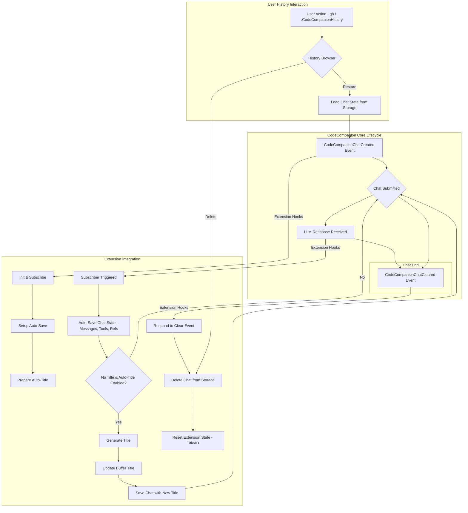

# CodeCompanion History Extension

[](https://neovim.io)
[](https://www.lua.org)
[](https://opensource.org/licenses/MIT)
[](./CONTRIBUTING.md)

A history management extension for [codecompanion.nvim](https://codecompanion.olimorris.dev/) that enables saving, browsing and restoring chat sessions.

## Features

- 💾 Automatic chat session saving with context preservation
- 🎯 Smart title generation for chats 
- 🔄 Continue from where you left
- 📚 Browse saved chats with preview
- 🔍 Multiple picker interfaces
- ⚡ Restore chat sessions with full context and tools state

## Requirements

- Neovim >= 0.8.0
- [codecompanion.nvim](https://codecompanion.olimorris.dev/)
- [telescope.nvim](https://github.com/nvim-telescope/telescope.nvim) (optional, for enhanced picker)

## Installation

Using [lazy.nvim](https://github.com/folke/lazy.nvim):

### First install the plugin

```lua
{
    "olimorris/codecompanion.nvim",
    dependencies = {
        --other plugins
        "ravitemer/codecompanion-history.nvim"
    }
}
```

### Add history extension to CodeCompanion config

```lua
require("codecompanion").setup({
    extensions = {
        history = {
            enabled = true,
            opts = {
                -- Keymap to open history from chat buffer (default: gh)
                keymap = "gh",
                -- Automatically generate titles for new chats
                auto_generate_title = true,
                ---On exiting and entering neovim, loads the last chat on opening chat
                continue_last_chat = false,
                ---When chat is cleared with `gx` delete the chat from history
                delete_on_clearing_chat = false,
                -- Picker interface ("telescope" or "default")
                picker = "telescope",
                ---Enable detailed logging for history extension
                enable_logging = false,
            }
        }
    }
})
```

## Usage 

#### Commands

- `:CodeCompanionHistory` - Open the history browser

#### Chat Buffer Keymaps

- `gh` - Open history browser (customizable via `opts.keymap`)

#### History browser

The history browser shows all your saved chats with:
- Title (auto-generated or custom)
- Last updated time  
- Preview of chat contents

Actions in history browser:
- `<CR>` - Open selected chat
- `x` - Delete selected chat (Doesn't apply to default vim.ui.select)

#### Title Generation

Chat titles are automatically generated based on the context of your conversation. You can:

- Let the extension auto-generate titles (controlled by `auto_generate_title`)
- See the titles updated in real-time as you chat

## How It Works

The extension enhances CodeCompanion by providing:



Here's what's happening in simple terms:

1. When you create a new chat, our extension jumps in and sets up two things:
   - An autosave system that will save your chat
   - A title generator that will name your chat based on the conversation

2. As you chat:
   - Every time you get a response, our extension automatically saves everything 
   - If your chat doesn't have a title yet, it tries to create one that makes sense
   - All your messages, tools, and references are safely stored

3. When you clear a chat:
   - Our extension knows to remove it from storage
   - This keeps your history clean and organized

4. Any time you want to look at old chats:
   - Use `gh` or the command to open the history browser
   - Pick any chat to restore it completely
   - Or remove ones you don't need anymore


## TODOs

- [ ] Add support for additional pickers like snacks, fzf etc

## Related Extensions

- [MCP Hub](https://codecompanion.olimorris.dev/extensions/mcphub.html) extension
- [VectorCode](https://codecompanion.olimorris.dev/extensions/vectorcode.html) extension 

## License

MIT
